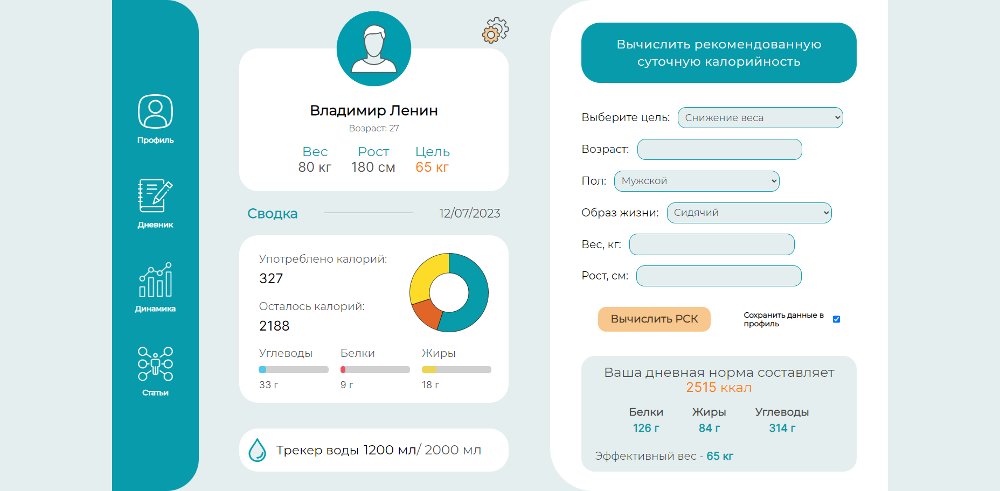
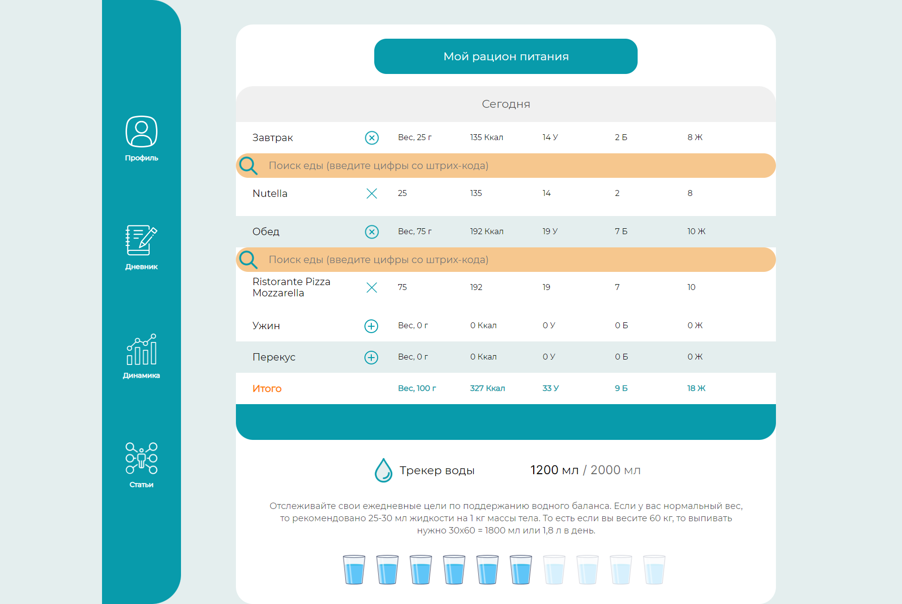
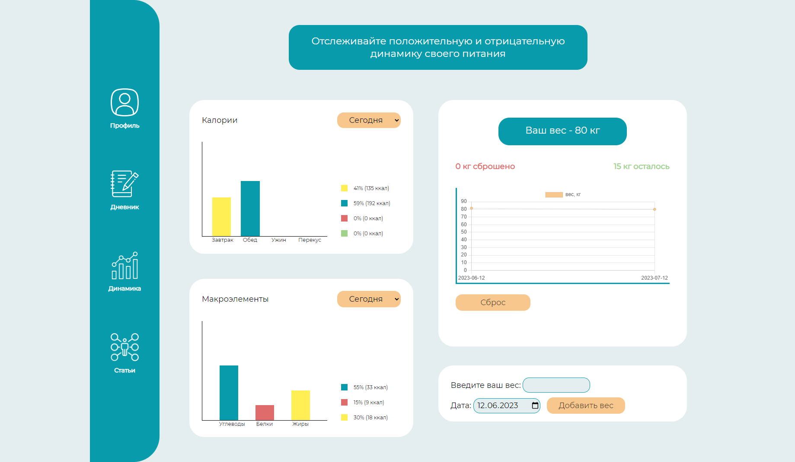
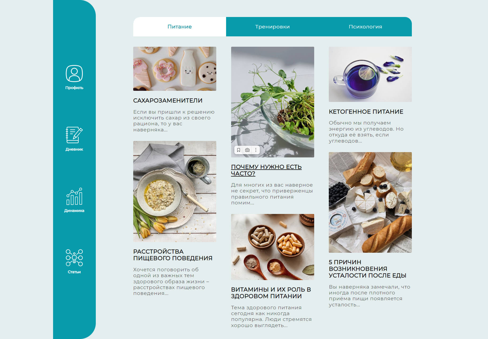

<h1>calorie_tracker</h1>

API-based calorie and macronutrient consumption tracker 

<h2>Inspiration</h2>

Being users from Russia, we faced the problem that some calorie trackers stopped supporting our accounts.

The available trackers weren't as pleasant to use or look like. This was a great reason to create our application.

<h2>How to make it work?</h2>

1.  Clone the repo:

        git clone https://github.com/neutrinna/calorie_tracker.git

2.  Host the parent directory on the webserver
3. To get started, you need to register and enter your profile.
4. Calculate your recommended daily calorie intake on the home page by selecting your goal (weight loss, weight maintenance, weight gain). Fill in all fields of the form.
5. Go to the diary page and enter the barcodes of the foods consumed at the desired meal (only barcodes from the site database https://en.openfoodfacts.org/ are supported)
6. Go to the "Dynamics" page to see charts of your consumption. Also, information about your current weight and other characteristics will be displayed on the main page
7. Personal information can be edited by clicking on the gear button on the main page

<h2>Technologies:</h2>

 

<h2>Result:</h2>
<a href="">Click here ✨</a>

